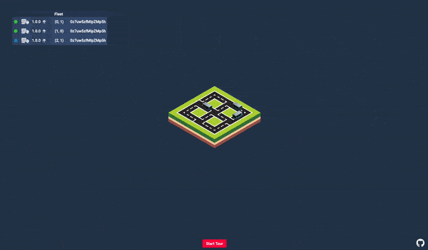

<p align="center">
# Hashimash

</p>

# Prerequisites

1. Docker: Packer creates two Docker images that contain the API and Web components

    https://docs.docker.com/install/

2. Helm: Consul and Vault are installed utilizing Helm charts that are cloned locally

    https://github.com/helm/helm
    
3. This project utilizes the Terraform local-exec provisioner to inject the resulting GKE cluster's kubeconfig into your 
local environment. This is utilized in conjunction with Helm to install the Consul and Vault helm charts as they are not 
currently hosted on a Helm repository. 

# Setting up the Environment

### Clone with Submodules
This project relies on a modified version of the HashiCorp Consul Helm chart that enables multi-dc WAN connections. 
In addition, this project also utilizes the HashiCorp Vault Helm Chart. As a result, these are included as a git submodule
to simplify the setup procedure.
```
git clone --recurse-submodules https://github.com/peytoncasper/hashimash
```

#### Export your GCP Project Id
```
export GOOGLE_PROJECT_ID=hashimash
```

#### Update gcloud to use your GCP Project
```
gcloud config set project $GOOGLE_PROJECT_ID
```

#### Enabled the Google Container Registry and Kubernetes Engine APIs

```
gcloud services enable containerregistry.googleapis.com
gcloud services enable container.googleapis.com
```

#### Create a GCP Service Account for Terraform/Packer
```
gcloud iam service-accounts create terraform-packer \
    --display-name "terraform-packer"
```

#### Export service account name 
```
export GOOGLE_SERVICE_ACCOUNT=terraform-packer
```

#### Add roles to Terraform/Packer Service Account
```
gcloud projects add-iam-policy-binding $GOOGLE_PROJECT_ID \
  --member serviceAccount:$GOOGLE_SERVICE_ACCOUNT@$GOOGLE_PROJECT_ID.iam.gserviceaccount.com \
  --role roles/compute.admin

gcloud projects add-iam-policy-binding $GOOGLE_PROJECT_ID \
  --member serviceAccount:$GOOGLE_SERVICE_ACCOUNT@$GOOGLE_PROJECT_ID.iam.gserviceaccount.com \
  --role roles/compute.instanceAdmin

gcloud projects add-iam-policy-binding $GOOGLE_PROJECT_ID \
  --member serviceAccount:$GOOGLE_SERVICE_ACCOUNT@$GOOGLE_PROJECT_ID.iam.gserviceaccount.com \
  --role roles/compute.networkAdmin

gcloud projects add-iam-policy-binding $GOOGLE_PROJECT_ID \
  --member serviceAccount:$GOOGLE_SERVICE_ACCOUNT@$GOOGLE_PROJECT_ID.iam.gserviceaccount.com \
  --role roles/container.admin

gcloud projects add-iam-policy-binding $GOOGLE_PROJECT_ID \
  --member serviceAccount:$GOOGLE_SERVICE_ACCOUNT@$GOOGLE_PROJECT_ID.iam.gserviceaccount.com \
  --role roles/container.clusterAdmin

gcloud projects add-iam-policy-binding $GOOGLE_PROJECT_ID \
  --member serviceAccount:$GOOGLE_SERVICE_ACCOUNT@$GOOGLE_PROJECT_ID.iam.gserviceaccount.com \
  --role roles/container.hostServiceAgentUser

gcloud projects add-iam-policy-binding $GOOGLE_PROJECT_ID \
  --member serviceAccount:$GOOGLE_SERVICE_ACCOUNT@$GOOGLE_PROJECT_ID.iam.gserviceaccount.com \
  --role roles/iam.serviceAccountUser

gcloud projects add-iam-policy-binding $GOOGLE_PROJECT_ID \
  --member serviceAccount:$GOOGLE_SERVICE_ACCOUNT@$GOOGLE_PROJECT_ID.iam.gserviceaccount.com \
  --role roles/storage.objectViewer
```

#### Create Service Account Key
```
gcloud iam service-accounts keys create credentials/credentials.json \
  --iam-account $GOOGLE_SERVICE_ACCOUNT@$GOOGLE_PROJECT_ID.iam.gserviceaccount.com
```

# Build and Deploy

#### Build the Packer Artifacts
```
packer build -var "google_project_id=$GOOGLE_PROJECT_ID" packer/api.json
packer build -var "google_project_id=$GOOGLE_PROJECT_ID" packer/web.json
packer build -var "google_project_id=$GOOGLE_PROJECT_ID" packer/sensor.json
```

#### Initialize Terraform Providers
```
terraform init terraform
```

#### Apply Terraform Environment
```
terraform apply -var="google_project_id=${GOOGLE_PROJECT_ID}" terraform
```

# Access the Environment

Assuming Terraform executed successfully, the output should look like this below and the Web UI is accessible on port 80
at the address listed. 
```
Apply complete! Resources: 15 added, 0 changed, 0 destroyed.

Outputs:

web-ui = 34.74.114.194
```

Since the Terraform local-exec provider was utilized to inject the GKE cluster's kubeconfig into your environment, the 
result of `kubectlget all` should look like this.

```
pod/api-1-0-0                                                         1/1     Running   0          7m15s
pod/api-1-0-1                                                         1/1     Running   0          7m15s
pod/hashicorp-consul-connect-injector-webhook-deployment-745d5l5xsh   1/1     Running   0          7m8s
pod/hashicorp-consul-server-0                                         1/1     Running   2          7m7s
pod/hashicorp-consul-sync-catalog-76c8976996-c7wmz                    1/1     Running   1          7m8s
pod/hashicorp-consul-xhcjw                                            1/1     Running   0          6m18s
pod/vault-0                                                           1/1     Running   0          7m8s
pod/vault-agent-injector-645b58f5dd-bmzrh                             1/1     Running   0          7m8s
pod/web                                                               1/1     Running   0          7m15s

NAME                                            TYPE           CLUSTER-IP      EXTERNAL-IP             PORT(S)                                                                   AGE
service/api-1-0-0-svc                           ClusterIP      10.59.249.250   <none>                  80/TCP                                                                    7m16s
service/api-svc-1-0-1                           ClusterIP      10.59.240.7     <none>                  80/TCP                                                                    7m16s
service/consul                                  ExternalName   <none>          consul.service.consul   <none>                                                                    3m48s
service/hashicorp-consul-connect-injector-svc   ClusterIP      10.59.246.54    <none>                  443/TCP                                                                   7m8s
service/hashicorp-consul-dns                    ClusterIP      10.59.243.148   <none>                  53/TCP,53/UDP                                                             7m8s
service/hashicorp-consul-server                 ClusterIP      None            <none>                  8500/TCP,8301/TCP,8301/UDP,8302/TCP,8302/UDP,8300/TCP,8600/TCP,8600/UDP   7m8s
service/hashicorp-consul-ui                     LoadBalancer   10.59.245.90    104.196.168.184         80:31108/TCP                                                              7m8s
service/kubernetes                              ClusterIP      10.59.240.1     <none>                  443/TCP                                                                   8m42s
service/vault                                   ClusterIP      10.59.242.60    <none>                  8200/TCP,8201/TCP                                                         7m9s
service/vault-agent-injector-svc                ClusterIP      10.59.240.61    <none>                  443/TCP                                                                   7m9s
service/vault-ui                                LoadBalancer   10.59.249.39    35.231.182.95           8200:31442/TCP                                                            7m9s
service/web-svc                                 LoadBalancer   10.59.245.44    34.74.114.194           80:30134/TCP                                                              7m15s

NAME                              DESIRED   CURRENT   READY   UP-TO-DATE   AVAILABLE   NODE SELECTOR   AGE
daemonset.apps/hashicorp-consul   1         1         1       1            1           <none>          7m8s

NAME                                                                   READY   UP-TO-DATE   AVAILABLE   AGE
deployment.apps/hashicorp-consul-connect-injector-webhook-deployment   1/1     1            1           7m8s
deployment.apps/hashicorp-consul-sync-catalog                          1/1     1            1           7m8s
deployment.apps/vault-agent-injector                                   1/1     1            1           7m9s

NAME                                                                              DESIRED   CURRENT   READY   AGE
replicaset.apps/hashicorp-consul-connect-injector-webhook-deployment-745d58fcb4   1         1         1       7m8s
replicaset.apps/hashicorp-consul-sync-catalog-76c8976996                          1         1         1       7m8s
replicaset.apps/vault-agent-injector-645b58f5dd                                   1         1         1       7m9s

NAME                                       READY   AGE
statefulset.apps/hashicorp-consul-server   1/1     7m8s
statefulset.apps/vault                     1/1     7m9s
```